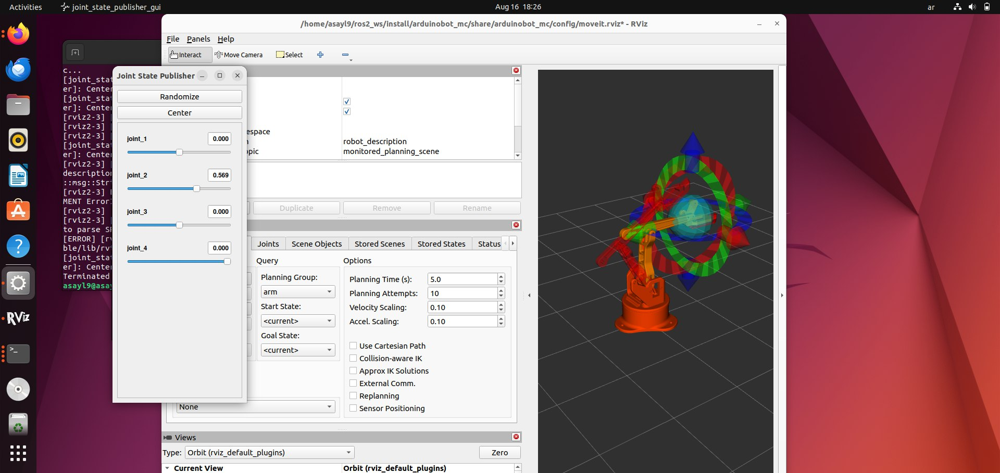
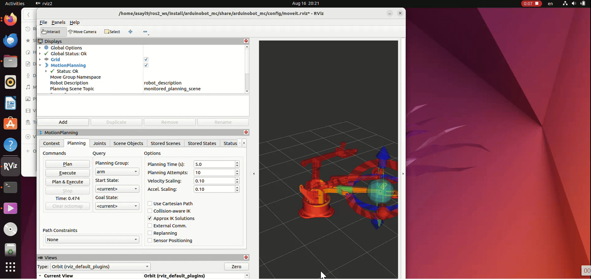
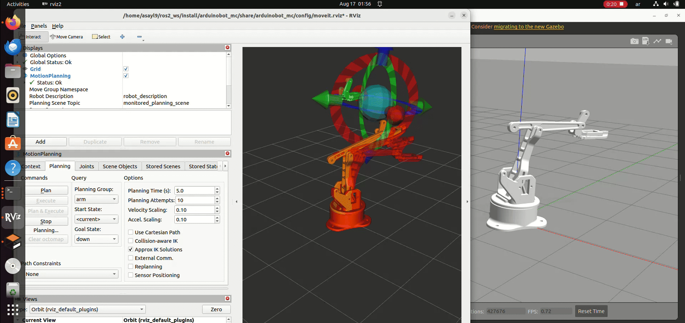

# Joint State and Kinematics Control Task

Controlling the robot arm in ROS2 either manually using joint_state_publisher or automatically using MoveIt with kinematics, in both simulation and hardware.

## Project Requirements

- ROS2 Humble on Ubuntu 22.04
- Simulation environment (RViz / Gazebo)
- Arduino + Servo motor for hardware execution

## Installation and Setup
Follow these steps to set up the project environment and dependencies.

### 1. Create a new workspace
```cpp
mkdir -p ~/ros2_ws/src
cd ~/ros2_ws
```

```cpp
git clone https://github.com/smart-methods/Robot_Arm_ROS2.git
```
> Note 1: make sure you already have git installed before cloning. If not:
```cpp
sudo apt update && sudo apt install -y git
```
> Note 2: after cloning, verify the package was downloaded:
```cpp
ls -la src/
```
You should see a folder named Robot_Arm_ROS2 inside ~/ros2_ws/src.

### 2. Install dependencies
```cpp
sudo apt-get update
sudo apt-get install -y \
  ros-humble-joint-state-publisher-gui \
  ros-humble-gazebo-ros \
  ros-humble-xacro \
  ros-humble-ros2-control \
  ros-humble-ros2-controllers \
  ros-humble-joint-state-broadcaster \
  ros-humble-joint-trajectory-controller \
  ros-humble-controller-manager \
  ros-humble-moveit \
  ros-humble-gazebo-ros2-control
```

### 3. Build the workspace
```cpp
colcon build --symlink-install
```

## Usage
### Controlling the robot arm by joint_state_publisher
## Usage

### 1. Controlling the robot arm with joint_state_publisher
In the joint_state_publisher GUI, you can move the sliders to change the arm’s joint angles in real time, and see the motion directly in RViz.

```bash
source /opt/ros/humble/setup.bash
source ~/ros2_ws/install/setup.bash
ros2 launch arduinobot_description display.launch.py
```



### 2. Planning with MoveIt (Kinematics / IK)
In MoveIt with RViz, you move the interactive markers to set the target pose.
Click "Planning" → MoveIt calculates the path using IK.
Preview the motion in RViz.
Click "Execute" → the arm follows the planned path (sim or hardware)



### 3. MoveIt with Gazebo (Simulation + Planning)
You can run Gazebo together with MoveIt to simulate and plan robot arm trajectories:


```cpp
# Terminal 1 - Launch Gazebo with the robot arm
source /opt/ros/humble/setup.bash
source ~/ros2_ws/install/setup.bash
ros2 launch arduinobot_mc gazebo.launch.py
```

```cpp
# Terminal 2 - Start MoveIt (planning context)
source /opt/ros/humble/setup.bash
source ~/ros2_ws/install/setup.bash
ros2 launch arduinobot_mc move_group.launch.py
```

```cpp
# Terminal 3 - Open RViz with MoveIt plugin
source /opt/ros/humble/setup.bash
source ~/ros2_ws/install/setup.bash
ros2 launch arduinobot_mc moveit_rviz.launch.py
```
- Gazebo will simulate the physics of the robot arm.
- RViz (with MoveIt) allows you to set target poses, plan, and execute them.
- When you Plan + Execute in RViz, the motion is carried out inside Gazebo.

### 4. Hardware Execution (Arduino + Servo)
